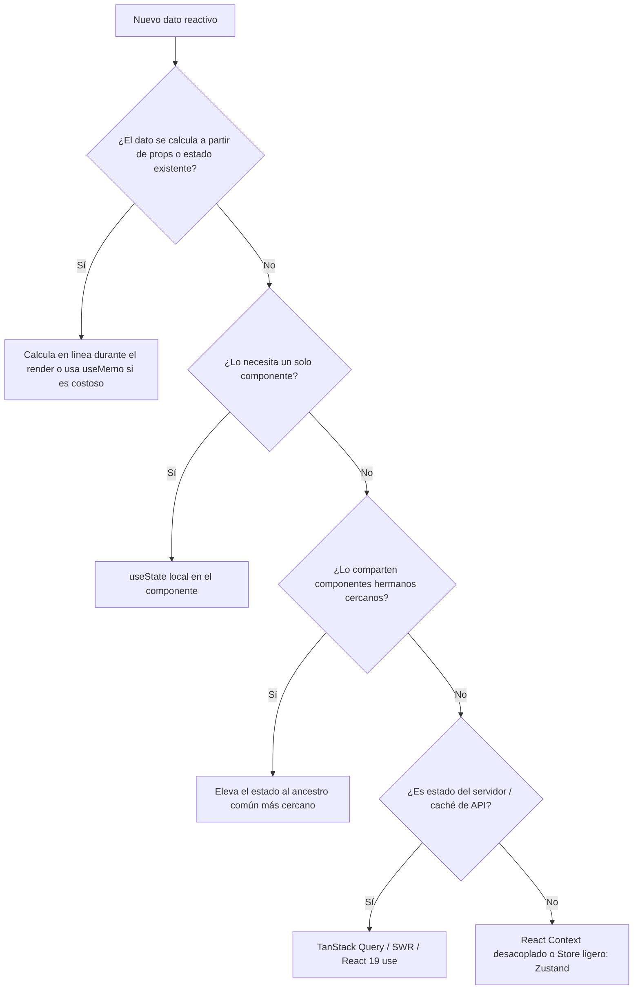
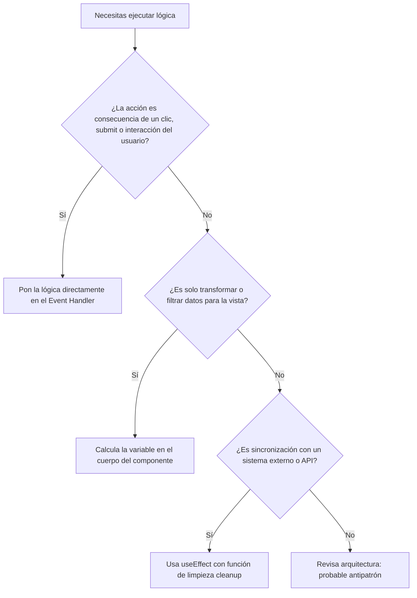

# React Master: Especialista en Arquitectura y Desarrollo React

Esta skill capacita al agente como un **Especialista de Dominio y Arquitecto en React**, garantizando código idiomático, óptimo, mantenible y alineado con los estándares modernos de React 18/19.

---

## 1. Principios Arquitectónicos Innegociables

1. **Flujo Unidireccional e Inmutabilidad**: Nunca mutes objetos ni arrays del estado directamente (`state.push()` o `obj.x = y`). Genera siempre copias inmutables (`[...arr, item]`, `{ ...obj, key: val }`).
2. **Componentes Puros e Idempotentes**: Dado el mismo conjunto de `props` y `state`, un componente debe retornar siempre el mismo JSX sin efectos secundarios durante el renderizado.
3. **Elevación de Estado Inteligente (*Lifting State Up*)**: Coloca el estado en el ancestro común más cercano que realmente lo necesite. No utilices estado global cuando baste con elevar el estado o componer componentes.
4. **Efectos como Mecanismo de Escape (*Effects as Escape Hatches*)**: No uses `useEffect` para transformar datos ni para manejar eventos que el usuario detonó directamente. Los efectos son exclusivamente para sincronizar con sistemas externos (APIs, DOM imperativo, suscripciones, timers).
5. **Claves de Lista Estables**: Usa siempre identificadores únicos y estables de base de datos como `key` en listas. Evita usar el índice del array (`key={index}`) en listas dinámicas, reordenables o filtrables.

---

## 2. Árboles de Decisión Rápidos

### A. Estrategia de Gestión de Estado


### B. ¿Deberías usar `useEffect`?


---

## 3. Patrones Idiomáticos vs. Antipatrones Críticos

### ✅ Patrón Idiomático: Estado Inmutable y Handlers Puros
```tsx
// Actualización declarativa e inmutable
const handleUpdateUser = (id: string, newRole: Role) => {
  setUsers(prevUsers =>
    prevUsers.map(user =>
      user.id === id ? { ...user, role: newRole } : user
    )
  );
};
```

### ❌ Antipatrón Crítico: Mutación Directa y Pérdida de Reactividad
```tsx
// ❌ PÉSIMO: Muta el array original; React no detectará el cambio de referencia
const handleUpdateUser = (id: string, newRole: Role) => {
  const user = users.find(u => u.id === id);
  if (user) {
    user.role = newRole; // Mutación en memoria
    setUsers(users);    // Mismo puntero de array, no re-renderiza
  }
};
```

---

## 4. Flujo de Trabajo para Nuevos Componentes

Al crear un nuevo componente o feature en React:

1. **Definir el Contrato de Props**: Modela interfaces TypeScript precisas, evitando tipos `any`.
2. **Identificar la Fuente de Verdad (*Single Source of Truth*)**: Determina si el componente es controlado (*controlled*) o no controlado (*uncontrolled*).
3. **Andamiar con el Script CLI**:
   ```powershell
   powershell -ExecutionPolicy Bypass -File .\.agents\skills\react-master\scripts\scaffold-component.ps1 -Name "UserCard" -TypeScript -CssModule
   ```
4. **Auditar con el Checklist**:
   Revisa el componente contra el [Checklist de Auditoría de Componentes](./resources/component-audit-checklist.md).

---

## 5. Divulgación Progresiva: Referencias y Ejemplos

Explora la documentación profunda según la necesidad técnica de la tarea:

### 📖 Documentación y Referencias de Dominio
* 📘 [Guía Rápida Oficial de React (Quick Start)](./references/react-quick-start.md) - Fundamentos, JSX, eventos, props y elevación de estado.
* ⚡ [Hooks y Ciclo de Vida a Fondo](./references/hooks-and-lifecycle.md) - Guía completa de `useState`, `useEffect`, `useCallback`, `useMemo`, `useRef` y reglas de hooks.
* 🔀 [Gestión de Estado y Flujo de Datos](./references/state-management-and-data-flow.md) - Elevación de estado, Context API optimizado y Server State.
* 🛡️ [Catálogo de Antipatrones y Rendimiento](./references/performance-and-antipatterns.md) - Cómo evitar re-renders innecesarios, fugas de memoria y closures obsoletos.
* 🧩 [Patrones Modernos de la Web](./references/modern-web-patterns.md) - *Compound Components*, *Headless UI*, *Error Boundaries* y *Suspense*.

### 💻 Ejemplos Canónicos de Producción
* 🌐 [Data Fetching con AbortController](./examples/data-fetching-custom-hook.tsx) - Custom Hook `useFetch` robusto con cache y cancelación.
* 🗂️ [Componentes Compuestos: Tabs Accesible](./examples/compound-tabs-component.tsx) - Patrón de pestañas WAI-ARIA desacoplado.
* 📝 [Formularios con Validación](./examples/form-management-with-validation.tsx) - Manejo de estados `touched`, errores y esquema.
* 🔄 [Elevación de Estado y Context Desacoplado](./examples/lifting-state-and-context.tsx) - Transición limpia de estado local a Context.
* 📜 [Lista Virtualizada de Alto Rendimiento](./examples/virtualized-infinite-list.tsx) - Manejo de grandes volúmenes de datos en scroll.

### 🛠️ Recursos y Plantillas
* 📄 [Plantilla de Componente Funcional](./resources/templates/component.template.tsx)
* 📄 [Plantilla de Custom Hook](./resources/templates/custom-hook.template.ts)
* ✅ [Checklist de Auditoría (12 puntos)](./resources/component-audit-checklist.md)
* ⚙️ [CLI Scaffolder](./scripts/scaffold-component.ps1)
