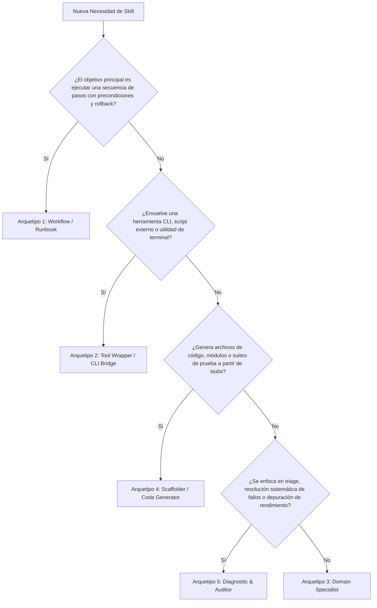

# Antigravity Skill Architect

Esta skill meta-arquitecta capacita al agente para diseñar, estructurar, generar y auditar **Agent Skills** de estándar profesional en Google Antigravity, garantizando fidelidad técnica al estándar de [Agent Skills](https://antigravity.google/docs/skills).

---

## 1. Filosofía Arquitectónica y Estándares

Al construir skills para el ecosistema Antigravity, debes regirte estrictamente por 4 pilares:

1. **Divulgación Progresiva (*Progressive Disclosure*)**: Mantén el archivo [`SKILL.md`](./SKILL.md) ágil y directo. Toda documentación densa, guías de estilo extensas o tablas de referencia deben residir en `references/` y vincularse con enlaces markdown relativos.
2. **Descripciones Semánticas de Alta Precisión**: El frontmatter es la puerta de entrada. Si la descripción no contiene las palabras clave tecnológicas y los momentos de uso ("Use when..."), el agente jamás activará la skill de forma autónoma.
3. **Scripts como Cajas Negras (*Black Boxes*)**: Todo script en `scripts/` debe invocarse como un comando o CLI, incentivando al agente a usar `--help` en lugar de saturar el contexto leyendo el código fuente completo.
4. **Determinismo y Verificación**: Cada paso de cambio debe contar con un mecanismo de comprobación tangible.

---

## 2. Árbol de Decisión de Arquetipos

Utiliza este diagrama de flujo para determinar el arquetipo exacto según la necesidad del usuario:



Para estudiar las particularidades, estructura y antipatrones de cada uno, consulta:
* 📖 [Guía Exhaustiva de Arquetipos](./references/archetypes-guide.md)

---

## 3. Protocolo de Construcción de Skills en 5 Fases

Cuando el usuario te solicite diseñar o crear una nueva skill, ejecuta rigurosamente las siguientes 5 fases:

### Fase 1: Análisis de Requisitos y Definición de Ámbito

1. **Identificar la Responsabilidad Única**: Delimita qué problema puntual resuelve la skill (*Keep skills focused*).
2. **Definir el Ámbito de Descubrimiento**:
   * **Workspace (`.agents/skills/<nombre>/`)**: Recomendado para proyectos de equipo, dependencias del repositorio o estándares compartidos en control de versiones.
   * **Global (`~/.gemini/config/skills/<nombre>/`)**: Para utilidades del desarrollador transversales a cualquier repositorio.
3. Para detalles de precedencia de carga, consulta:
   * 📘 [Especificaciones Técnicas de Google Antigravity](./references/antigravity-specs.md)

---

### Fase 2: Clasificación de Arquetipo

Selecciona una de las 5 plantillas base según el árbol de decisión:
* 📄 [Plantilla Workflow](./resources/templates/template-workflow.md)
* 📄 [Plantilla Tool Wrapper](./resources/templates/template-tool-wrapper.md)
* 📄 [Plantilla Domain Specialist](./resources/templates/template-domain-expert.md)
* 📄 [Plantilla Code Scaffolder](./resources/templates/template-code-scaffold.md)
* 📄 [Plantilla Diagnostic Auditor](./resources/templates/template-diagnostic-auditor.md)

---

### Fase 3: Ingeniería de Frontmatter y Disparadores

Construye el bloque YAML superior cumpliendo las siguientes reglas:

```yaml
---
name: nombre-en-kebab-case
description: >-
  Acción en 3ra persona en presente ("Manages...", "Audits...", "Configures...").
  Objetivo tecnológico preciso (ej. "React 3D scene creation with Three.js").
  Directriz de activación explícita ("Use when configuring 3D canvases, writing shaders, or diagnosing WebGL performance").
---
```

* **Nombre**: Debe ser conciso y coincidir con el nombre de la carpeta para habilitar el slash command (`/nombre-en-kebab-case`).
* **Descripción**: Redacta en tercera persona e incorpora términos técnicos de búsqueda frecuentes.

---

### Fase 4: Andamiaje Estructural (*Scaffolding*)

Crea la estructura de carpetas y archivos. Puedes utilizar el script automatizado de PowerShell incluido en esta skill:

```powershell
# Ejecución del scaffolder automatizado
powershell -ExecutionPolicy Bypass -File .\.agents\skills\skill-architect\scripts\scaffold-skill.ps1 -Name "<nombre-skill>" -Archetype "<arquetipo>" -Scope "workspace"
```

El script creará automáticamente:
* `<nombre-skill>/SKILL.md` (con el arquetipo inyectado)
* `<nombre-skill>/scripts/`
* `<nombre-skill>/resources/`
* `<nombre-skill>/references/`
* `<nombre-skill>/examples/`

Personaliza los pasos en `SKILL.md` y añade los archivos de soporte correspondientes.

---

### Fase 5: Auditoría y Verificación de Calidad

Antes de finalizar la entrega, audita la nueva skill confrontándola contra los 10 puntos de la lista de verificación:
* ✅ [Lista de Verificación de Calidad para Skills](./resources/skill-validation-checklist.md)

Confirma:
1. Sintaxis YAML sin errores.
2. Cero duplicación de conocimiento general.
3. Rutas y enlaces relativos válidos.
4. Presencia de pasos de verificación observables.
