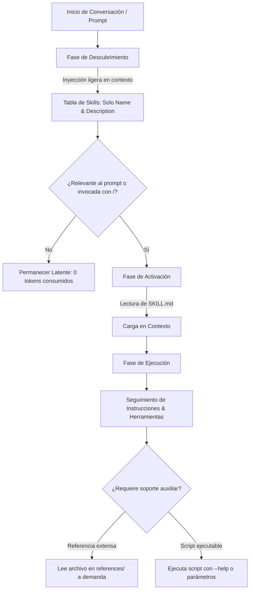

# Especificaciones Técnicas de Skills en Google Antigravity

Documento de referencia técnica basado en la documentación oficial de [Google Antigravity Docs (Skills)](https://antigravity.google/docs/skills) y el estándar abierto [Agent Skills (agentskills.io)](https://agentskills.io/home).

---

## 1. Definición y Estándar Abierto

Las **Agent Skills** son paquetes reutilizables y modulares de conocimiento, procedimientos y herramientas diseñados para extender las capacidades del agente autónomo. Siguen el estándar abierto `agentskills.io`.

Cada skill encapsula:
* **Instrucciones (`Instructions`)**: Protocolos deterministas y explícitos para abordar tareas específicas.
* **Mejores Prácticas (`Best Practices`)**: Convenciones de arquitectura, directrices de estilo y listas de verificación.
* **Scripts y Recursos (`Scripts & Resources`)**: Herramientas ejecutables, esquemas de datos y plantillas auxiliares.

---

## 2. Anatomía de una Skill

Toda skill reside en una carpeta nombrada con la identidad de la skill y debe contener obligatoriamente el manifiesto `SKILL.md`:

```text
<skill-folder>/
├── SKILL.md          # [OBLIGATORIO] Manifiesto con frontmatter YAML e instrucciones
├── scripts/          # [OPCIONAL] Scripts ejecutables de automatización o utilidades
├── examples/         # [OPCIONAL] Implementaciones de referencia y código modelo
├── resources/        # [OPCIONAL] Plantillas de código, esquemas JSON, assets o datos
└── references/       # [OPCIONAL] Documentación profunda, manuales y guías de soporte
```

---

## 3. Formato del Manifiesto (`SKILL.md`)

Todo archivo `SKILL.md` debe iniciar estrictamente con un bloque de **YAML Frontmatter**:

```markdown
---
name: nombre-de-la-skill
description: >-
  Describe en tercera persona qué hace la skill y cuándo debe activarse el agente.
  Incluye palabras clave semánticas relevantes.
---

# Título de la Skill

[Instrucciones paso a paso, checklist y protocolos...]
```

### Campos del Frontmatter

| Campo | Requerido | Tipo | Descripción |
| :--- | :---: | :---: | :--- |
| `name` | Opcional | `string` | Identificador único en minúsculas y separado por guiones (`kebab-case`). Si se omite, toma por defecto el nombre del directorio contenedor. |
| `description` | **Sí** | `string` | **El campo más crítico**. El agente lee esta descripción durante el ciclo de descubrimiento para decidir autónomamente si activa o no la skill ante el prompt del usuario. |

> [!TIP]
> **Regla de oro para la descripción**: Redactar siempre en tercera persona singular ("Reviews...", "Generates...", "Configures..."). Debe detallar explícitamente el **QUÉ** y el **CUÁNDO** (contexto, tecnologías y palabras clave).
> *Ejemplo óptimo*: `"Generates and optimizes unit tests for Python code using pytest conventions. Use when writing, refactoring, or evaluating test suites."`

---

## 4. Ciclo de Vida y Ejecución de Skills

Antigravity opera bajo el principio de **Divulgación Progresiva (*Progressive Disclosure*)** para proteger la ventana de contexto del modelo de lenguaje:



1. **Descubrimiento (*Discovery*)**: Al iniciar la sesión, el agente solo recibe una lista compacta con los nombres y descripciones de las skills disponibles. El cuerpo del archivo `SKILL.md` NO se carga inicialmente.
2. **Activación (*Activation*)**:
   * **Invocación Autónoma**: El modelo compara el prompt del usuario con las descripciones y decide leer el archivo `SKILL.md` si encuentra coincidencia semántica.
   * **Invocación Manual / Slash Command**: El usuario escribe `/<skill-name>` en el panel de chat o terminal interactiva. Antigravity convierte automáticamente cualquier skill descubierta en un comando slash.
3. **Ejecución (*Execution*)**: El agente carga las instrucciones y procede a ejecutarlas secuencialmente.

---

## 5. Ubicaciones y Ámbitos de Descubrimiento

Antigravity localiza las skills buscando jerárquicamente en las siguientes rutas según la superficie de ejecución:

| Superficie | Ámbito del Proyecto (Workspace) | Ámbito Global (Estación de trabajo) |
| :--- | :--- | :--- |
| **Antigravity IDE** | `<workspace-root>/.agents/skills/<skill-folder>/` *(retrocompatible con `.agent/skills/`)* | `~/.gemini/config/skills/<skill-folder>/` *(retrocompatible con `~/.gemini/antigravity/skills/`)* |
| **Antigravity 2.0** | `<workspace-root>/.agents/skills/<skill-folder>/` | `~/.gemini/config/skills/<skill-folder>/` |
| **Antigravity CLI** | `<workspace-root>/.agents/skills/<skill-folder>/` | `~/.gemini/antigravity-cli/skills/<skill-folder>/` *(Plugins: `plugins/<name>/skills/`)* |

### Prioridad de Carga y Resolución de Conflictos

Si dos skills tienen el mismo `name`, se resuelve en el siguiente orden de mayor a menor precedencia:
1. **Workspace Project (`.agents/skills/`)**: Sobrescribe cualquier skill global o built-in.
2. **Configuraciones Declaradas en Workspace (`skills.json` / `plugins.json`)**.
3. **Global de Usuario (`~/.gemini/config/skills/`)**.
4. **Skills Nativas / Built-in** (empaquetadas con el sistema Antigravity).

---

## 6. Principios y Mejores Prácticas Oficiales

1. **Foco Único (*Keep Skills Focused*)**: Cada skill debe resolver un dominio o proceso específico de forma excelente. Evitar skills monolíticas que intenten "hacerlo todo".
2. **Scripts como Cajas Negras (*Scripts as Black Boxes*)**: Si la skill cuenta con scripts en `scripts/`, instruir al agente a ejecutarlos directamente o consultar su interfaz mediante `--help`, en lugar de leer cientos de líneas de código fuente en el contexto.
3. **Árboles de Decisión (*Decision Trees*)**: En procesos complejos o sujetos a condiciones de entorno, incluir diagramas o condicionales lógicos para que el agente elija la rama adecuada sin titubeos.
4. **Pasos de Verificación Explícitos**: Todo paso de modificación debe ir acompañado de una acción de prueba o validación que confirme el éxito del paso antes de continuar.
5. **Cero Duplicación de Conocimiento General**: No gastar tokens enseñando al modelo sintaxis básica de lenguajes ni conceptos que ya domina; enfocarse en las particularidades de la arquitectura, reglas del repositorio y procedimientos del equipo.
