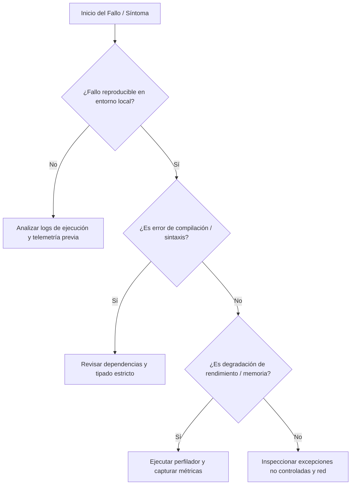

# Diagnóstico y Auditoría: {{SKILL_TITLE}}

Protocolo de triage sistemático y diagnóstico para {{SYSTEM_NAME}}.

---

## 1. Árbol de Decisión de Diagnóstico



---

## 2. Metodología de Triage (Hipótesis & Prueba)

1. **Recolección de Evidencia**:
   - Inspeccionar logs de consola, mensajes de error y código de salida.
   - Ejecutar script de recolección:
     ```powershell
     .\scripts\collect-diagnostic.ps1
     ```
2. **Formulación de Hipótesis**:
   - Identificar la causa raíz más probable (evitar modificar código sin hipótesis).
3. **Prueba Aislada**:
   - Probar la solución en un alcance acotado.
4. **Validación y Cierre**:
   - Ejecutar la suite completa para asegurar que no existan regresiones.

---

## 3. Catálogo de Problemas Conocidos

Consulta soluciones a incidentes previos en:
* [Problemas Conocidos y Remedios](./references/known-issues.md)
